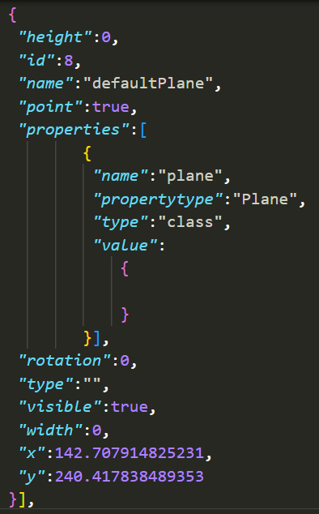
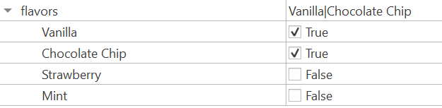

# Overview

This package provides an easy way to parse information from entire Tiled projects, including the Tiled project file and the Tiled map files.

It also provides a way to mimic object-oriented inheritance and composition in Tiled custom types. The output of each parsed object is a flattened object that contains all the properties of the object, including the properties of the custom types that the object inherits from.

In addition, options can be specified to control the behavior of the parser, such as whether to flatten the properties of the custom types, or to keep them nested.

## Problem

In the Tiled program, when a project is created, the data is saved separately:
- The project file contains information about custom types as defined in the Custom Types Editor, which may compose other custom types within them.
- The map file contains information about the map itself, including the layers, tilesets, and objects, which may be of the custom types defined in the project file.

The problem arises when you want to use the custom types in your game engine, such as within _Phaser_.

_Phaser_ provides no easy way to read the project files, so you will need to parse both project and map files manually.

Here is an example of an object with custom properties of a custom type defined in the project file:


The class field references a custom type declared in the project file.

In addition, when nesting types, if no custom property is overwritten, the value field of the nested type will be empty, as it assumes the default properties of the nested type referred to by name.



So, resolving the references and overwritting the properties with the new properties defined on each object can be a tedious task.

Lastly, Tiled does not provide a way to extend custom types. To retrieve a property from an object, one would have to go through several nested properties, such as `audiA4.properties.car.motorVehicle.vehicle.amountofFuelLeft`. This is not ideal, as it is not intuitive to use nor easy to refactor.

## Solution

This package solves these problems by providing a way to parse the project file and map file, and then resolve the references between the two. The output is a single object that contains all the information about the map, including the custom type properties of each object flattened into its own properties - as if the properties were declared on the object itself.

This is accomplished by mimicking the concept of inheritance in Tiled custom types - custom type A is defined to inherit another custom type B if custom type A has a member of type B. This is done recursively until the base type is reached. The properties of the base type are then copied into the properties of the derived type, and the modified properties of the derived type overwrite the default properties of the base type.

Composition is also possible. This is done by defining a member of type B in custom type A with the prefix `@composite:`. Then, the member of type B remains a nested property of type A, but the nested properties of member B can still be flattened in itself. To better understand this feature, read the section on [Declaring composite properties](#declaring-composite-properties).

With this package, you can directly access the expected property via `.<PROPERTY_NAME>`, as if the property was directly declared on the object itself.

In the above example, one can access the `amountOfFuelLeft` property of the `audiA4` object by simply accessing `audiA4.amountOfFuelLeft`.

## Installation

```bash
npm install tiled-property-flattener
```

This project also supports TypeScript type definitions.

## Usage

---

To preview what the parsed map will look like:

First, clone the project from GitHub and install the dependencies.

For single map files:
```bash
npm start -p <PROJECT_FILE_PATH> [ -t <PROJECT_OUTPUT_PATH> ] [ -m <MAP_FILE_PATH> -o <OUTPUT_FILE> ]
```

| Option | Description |
| --- | --- |
| -p, --project-file | The path to the project file. |
| -t, --output-project | The path to the output project file, if outputting the project file JSON is desired. |
| -m, --map-file | The path to the map file. This must be specified together with the output file.|
| -o, --output | The path to the output file. This must be specified together with the map file.|

This will output a single JSON file containing the parsed map.

For multiple map files (batch mode):
```bash
npm start -- -b <path-to-project-directory> -o <path-to-output-directory>
```

| Option | Description |
| --- | --- |
| -b, --batch | The path to the project directory. |
| -o, --output | The path to the output directory. Both the parsed project file and maps files will be output here. |

This will output a JSON file for each map file in the project directory to the specified output directory.

---

To use in your code:

First, run the npm install command above.

Then, import the package and use the parsers:

```typescript
import { TiledProjectParser, TiledMapParser, type TiledProjectParsedResult, type TiledMapParsedResult } from 'tiled-property-flattener';

// Assuming you have the `projectFileData` ready as a JSON object...
const parsedProject = TiledProjectParser.parse(projectFileData);

// You can read the properties of the custom types,
// which is map of the custom type name to its flattened properties.
console.log("Project types:", parsedProject.getCustomTypesMap());
// You can also read the enums, which are a map of the enum name to a Set of its values.
console.log("Project enums:", parsedProject.getEnumsMap());

// Assuming you have the `mapFileData` ready as a JSON object...
const parsedMap = TiledMapParser.parse(mapFileData, parsedProject);

// Now you can access the flattened properties,
// which is a map of the object/layer/tileset id to its flattened properties.
console.log(parsedMap.getObjectIdToPropertiesMap());

console.log(parsedMap.getLayerIdToPropertiesMap());

console.log(parsedMap.getTilesetIdToPropertiesMap());

// Note: These accessors will copy the properties into a new object to prevent mutation, 
// so you should cache the result if you need to access it multiple times.
```

Note, every object contains the basic properties as defined in Tiled: ID, name, x and y. The objects and layers are inherently mapped by their IDs, because Tiled generates unique IDs for each object and layer (separately).

You may wish to transform this data into a format more suitable for your use.

In addition, enums are also supported. Enums are defined in the project file, and are used in the map file. The enums are resolved and flattened into the properties of the objects and layers that use them as a _Set_.

## Declaring composite properties

Sometimes, it is desirable to maintain the nested properties of a custom type, instead of flattening them, such as one object possess two members of the same types. This is possible by declaring a member of type B in custom type A with the prefix `@composite:`. Then, the member of type B remains a nested property of type A, but the nested properties of member B can still be flattened.

Here is an example - this Boeing737 has 2 engines. Each engine is declared as a composite property. Therefore, the members of type `Engine` are not flattened, but the nested properties of each engine are flattened.


When the properties are parsed and flattened, we get the following result:


Note that all properties were flattened, except for the two engine marked with `@composite:`. However, as both engines extended from the the Matter class, the properties of the Matter parent class were flattened into each engine class.

Additionally, enums would be represented by the Set data structure, but as this is a parsed array, it is shown as an array in the image above.

## Interpreting the data

### Project Files

By default, project files are parsed into a `TiledProjectParsedResult` object, which contains two maps: one for the custom types and one for the enums.

Both maps will map the name of the custom type/enum to the properties of the custom type/enum.

#### Custom Types

In the custom types map, the map directly maps the name of the custom type to the properties of the custom type as an object of key-value pairs. The keys are the names of the properties, and the values are the properties values themselves.

#### Enums

For enums, since Tiled specifies an additional option to set enums as flags, the enum name is mapped to a EnumValues object. The EnumValues extend from Set, and contains the values of the enum.
Since The EnumValues object also contains a `valuesAsFlags` property, which is true if the enum is a flag-like, and false otherwise.

Regardless of whether the `valuesAsFlags` property is true or false, the values of the enum are always stored as a Set.

### Map Files

By default, map files are parsed into a `TiledMapParsedResult` object, which contains three maps: one for the objects, one for the layers, and one for the tilesets.

#### Object and Layer Properties

The object and layer maps will map the ID of the object/layer to the properties of the object/layer as an object of key-value pairs. The keys are the names of the properties, and the values are the properties values themselves.

#### Tileset Properties

The tileset layer exhibits slightly different properties. Tilesets in tiled have no set ID, instead, they are identified by their first global tile ID (`firstgid`). Therefore, the tileset map will map the first global tile ID of the tileset to the properties of the tileset as an object of key-value pairs. The keys are the names of the properties, and the values are the properties values themselves.

In addition, within the tileset properties, there is a `tiles` property, which further maps the local tile ID to the properties of the tile as an object of key-value pairs. The keys are the names of the properties, and the values are the properties values themselves. This follows the layout of the map JSON file as specified by Tiled.

#### Enums

Enums may be the values of properties of objects, layers and tiles.

#### Enums not as flags

Enums that are not associated with flags will be set to the primitive value of the enum.

For example, if the enum, `Color`, is a string enum with the values `White`, `Red`, `Blue` and `Yellow`, then the value of the property will be one of these strings.


```json
{
    // ... other properties
    "color": "White"
    // ... more properties
}
```

#### Enums as flags

Enums that are set to be flags will be set to a Set of the values of the enum.

For example, if the enum, `Flavors` is a flag enum with the values `Vanilla`, `Chocolate Chip`, `Strawberry` and `Mint`, then the value of the property will be a Set of these strings, regardless of how many values are set.



```json
{
    // ... other properties
    "flavors": Set<string> {
        "Vanilla",
        "Chocolate Chip"
    }
    // ... more properties
}
```