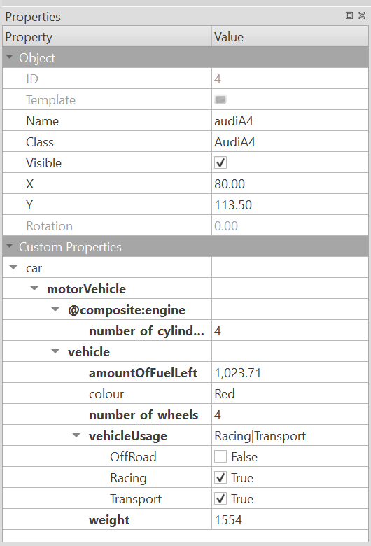
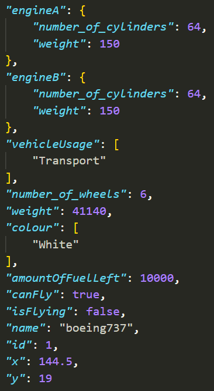

# Overview

This package provides an easy way to parse information from the Tiled project file and the Tiled map files.

It also provides a way to mimic object-oriented inheritance and composition in Tiled custom types. The output of each parsed object is a flattened object that contains all the properties of the object, including the properties of the custom types that the object inherits from.

## Problem

In the Tiled program, data is saved separately:
- The project file contains information about custom types as defined in the Custom Types Editor, which may compose other custom types within them.
- The map file contains information about the map itself, including the layers, tilesets, and objects, which may be of the custom types defined in the project file.

The problem arises when you want to use the custom types in your game engine, such as within _Phaser_.
_Phaser_ provides no easy way to read the project files, so you will need to parse both project and map files manually.

Here is an example of an object with custom properties of a custom type defined in the project file:


In addition, types refer to each other via name, so resolving the references and overwritting the properties with the new properties defined on each object is a difficult task.

Lastly, Tiled does not provide a way to extend custom types. To retrieve a property from an object, one go through several nested properties, such as `audiA4.properties.car.motorVehicle.vehicle.amountofFuelLeft`. This is not ideal, as it is not intuitive to use, and it is not easy to refactor.

## Solution

This package solves these problems by providing a way to parse the project file and map file, and then resolve the references between the two. The output is a single object that contains all the information about the map, including the custom type properties of each object flattened into its own properties - as if the properties were declared on the object itself.

This is accomplished by mimicking the concept of inheritance in Tiled custom types - custom type A is defined to inherit another custom type B if custom type A has a member of type B. This is done recursively until the base type is reached. The properties of the base type are then copied into the properties of the derived type, and the properties of the derived type overwrite the properties of the base type.

Composition is also possible, by blocking the flattened properties of the base type from being copied into the derived type. This is done by defining a member of type B in custom type A with the prefix `@composite:`. Then, the member of type B remains a nested property of type A, but the nested properties of member B can still be flattened. To better understand this feature, read the section on [Declaring composite properties](#declaring-composite-properties).

With this package, you can directly access the expected property via `.<PROPERTY_NAME>`, as if the property was directly declared on the object itself.

In the above example, one can access the `amountOfFuelLeft` property of the `audiA4` object by simply accessing `audiA4.amountOfFuelLeft`.

## Installation

```bash
npm install tiled-property-flattener
```

## Usage

To preview what an object will look like:

For single map files:
```bash
npm start -- -p <path-to-project-file> -m <path-to-map-file> -o <path-to-output-file>
```

For multiple map files (batch mode):
```bash
npm start -- -b <path-to-project-directory> -o <path-to-output-directory>
```

To use in your code:
```typescript
import { TiledProjectParser, TiledMapParser, type TiledProjectParsedResult, type TiledMapParsedResult } from 'tiled-property-flattener';

// Assuming you have the `projectFileData` ready as a JSON object...
const parsedProject = TiledProjectParser.parse(projectFileData);

// You can read the properties of the custom types,
// which is map of the custom type name to its flattened properties.
console.log("Project types:", parsedProject.getCustomTypes());
// You can also read the enums, which are a map of the enum name to a Set of its values.
console.log("Project enums:", parsedProject.getEnums());

// Assuming you have the `mapFileData` ready as a JSON object...
const parsedMap = TiledMapParser.parse(mapFileData, parsedProject);

// Now you can access the flattened properties,
// which is a map of the object/layer id to its flattened properties.
console.log(parsedMap.getObjectIdToPropertiesMap());

console.log(parsedMap.getLayerIdToPropertiesMap());

// Note: These accessors will copy the properties into a new object to prevent mutation, 
// so you should cache the result if you need to access it multiple times.
```

Note, every object contains the basic properties as defined in Tiled: ID, name, x and y. The objects and layers are inherently mapped by their IDs, because Tiled generates unique IDs for each object and layer (separately).

You may wish to transform this data into a format more suitable for your use.

In addition, enums are also supported. Enums are defined in the project file, and are used in the map file. The enums are resolved and flattened into the properties of the objects and layers that use them as a _Set_.

## Declaring composite properties

Sometimes, it is desirable to maintain the nested properties of a custom type, instead of flattening them, such as one object possess two members of the same types. This is possible by declaring a member of type B in custom type A with the prefix `@composite:`. Then, the member of type B remains a nested property of type A, but the nested properties of member B can still be flattened.

Here is an example - this Boeing737 has 2 engines. Each engine is declared as a composite property. Therefore, the members of type `Engine` are not flattened, but the nested properties of each engine are flattened.


When the properties are parsed and flattened, we get the following result:


Note that all properties were flattened, except for the two engine marked with `@composite:`. However, as both engines extended from the the Matter class, the properties of the Matter parent class were flattened into each engine class.
